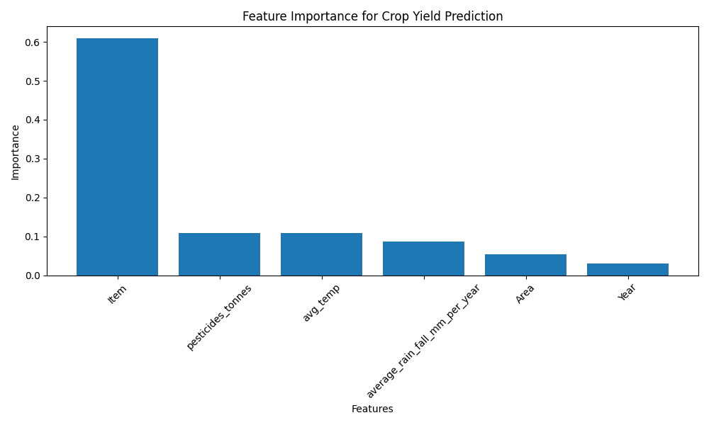

<div align="center">

# 🌱 AgriPredict AI

### Crop Yield Prediction & Market Price Forecasting using Machine Learning

*An end-to-end AI system that helps farmers and agribusinesses make data-driven decisions.*


</div>

---

## 📋 Table of Contents

- [Overview](#-overview)
- [Features](#-features)
- [Screenshots](#-screenshots)
- [System Architecture](#️-system-architecture)
- [Project Structure](#-project-structure)
- [Machine Learning Models](#-machine-learning-models)
- [Technologies Used](#️-technologies-used)
- [Installation](#️-installation)
- [Running the App](#️-running-the-app)
- [API Reference](#-api-reference)
- [Known Model Behavior](#-known-model-behavior)
- [Docker Deployment](#-docker-deployment)
- [Future Improvements](#-future-improvements)
- [Author](#-author)

---

## 🌾 Overview

**AgriPredict AI** provides two AI-powered prediction services through a REST API and an interactive dashboard:

| Service | Description |
|---|---|
| 🌱 **Crop Yield Prediction** | Estimates crop yield (hg/ha) from area, crop type, year, rainfall, pesticide use, and temperature |
| 💰 **Market Price Forecasting** | Predicts market price (₹) from state, district, market, commodity, variety, grade, and recent price trends |

Both services are backed by trained **Random Forest Regressor** models, served through a **FastAPI** backend and consumed by a **Streamlit** dashboard with dynamic, dataset-driven dropdowns (state → district → market cascading selection).

---

## 🚀 Features

- 🌾 Crop Yield Prediction with validated categorical inputs
- 💰 Crop Market Price Forecasting with cascading location selection
- 📊 Data analysis & visualization (correlation heatmaps, feature importance)
- 🚀 REST API built with FastAPI, auto-documented via Swagger UI
- 🎨 Interactive dashboard built with Streamlit
- ✅ Input validation against trained encoder classes — invalid inputs return clean errors, not crashes
- 🐳 Docker-ready for deployment

---

## 📸 Screenshots

> Add screenshots below before submitting — this section is what reviewers look at first.

### Yield Prediction Dashboard
```

```

### Price Prediction Dashboard
```

```

### FastAPI Swagger Docs
```

```

### Feature Importance / Model Insights
```

```

**How to add these:**
1. Create a `screenshots/` folder in your project root.
2. Save PNG screenshots of your running Streamlit app (Yield tab, Price tab, and a successful prediction) into that folder.
3. Replace the placeholder paths above with your actual filenames — the image will render automatically on GitHub once pushed.

---

## 🏗️ System Architecture

```
                        User
                         │
                         ▼
               Streamlit Dashboard
                         │
                         ▼
                     FastAPI
                         │
          ┌──────────────┴──────────────┐
          ▼                             ▼
   Yield Prediction              Price Forecasting
   (Random Forest)               (Random Forest)
          │                             │
          └──────────────┬──────────────┘
                         ▼
                   Trained Models
                    (.pkl files)
                         │
                         ▼
                    Predictions
```

---

## 📂 Project Structure

```
AgriPredict-AI/
│
├── api/
│   ├── main.py                     # FastAPI entrypoint, lifespan model loading
│   ├── routes/
│   │   ├── yield_routes.py         # /yield/predict, /yield/options
│   │   └── price_routes.py         # /price/predict-price, /price/options,
│   │                                # /price/states, /price/districts/{state}, /price/markets/{district}
│   ├── schemas/
│   │   ├── yield_schema.py
│   │   └── price_schema.py
│   └── utils/
│       └── model_loader.py         # Preloads all models on API startup
│
├── data/
│   ├── raw/
│   │   ├── crop_yield_raw.csv
│   │   └── crop_price_raw.csv
│   └── processed/
│       ├── yield_processed.csv
│       ├── price_processed.csv
│       └── price_features.csv
│
├── models/
│   ├── yield_prediction_model.pkl
│   ├── price_forecasting_model.pkl
│   ├── area_encoder.pkl
│   ├── crop_encoder.pkl
│   └── price_encoders.pkl
│
├── notebooks/                      # Data analysis, feature engineering, model training
│
├── src/
│   ├── data/
│   │   ├── preprocessing.py
│   │   └── price_preprocessing.py
│   ├── features/
│   │   ├── feature_engineering.py
│   │   └── price_feature_engineering.py
│   ├── models/
│   │   ├── yield_model.py
│   │   ├── price_model.py
│   │   └── evaluate.py
│   └── prediction/
│       ├── predict.py              # Yield prediction + encoder validation
│       ├── price_predict.py        # Price prediction + safe encoding
│       └── location_data.py        # State → District → Market mapping
│
├── frontend/
│   └── streamlit_app.py            # Streamlit UI with cascading dropdowns
│
├── visualization/
│   ├── correlation_heatmap.png
│   ├── feature_importance.png
│   └── price_trend.png
│
├── screenshots/                    # App screenshots for this README
├── requirements.txt
├── Dockerfile
└── README.md
```

---

## 🧠 Machine Learning Models

### Crop Yield Model

| Model | R² Score |
|---|---|
| Linear Regression | 0.08 |
| XGBoost | 0.96 |
| **Random Forest** ⭐ | **0.985** |

**Best Model:** Random Forest Regressor

| Metric | Value |
|---|---|
| MAE | 3741.53 |
| RMSE | 10190.30 |
| R² | 0.9856 |

### Price Prediction Model

| Model | R² Score |
|---|---|
| XGBoost | 0.977 |
| **Random Forest** ⭐ | **0.994** |

**Best Model:** Random Forest Regressor

| Metric | Value |
|---|---|
| MAE | 35.13 |
| RMSE | 133.45 |
| R² | 0.994 |

---

## 🛠️ Technologies Used

| Category | Tools |
|---|---|
| **Language** | Python 3.10 |
| **Machine Learning** | scikit-learn, XGBoost, pandas, NumPy |
| **Backend** | FastAPI, Uvicorn, Pydantic |
| **Frontend** | Streamlit |
| **Deployment** | Docker, Cloud Hosting |

---

## ⚙️ Installation

**1. Clone the repository**
```bash
git clone https://github.com/yourusername/AgriPredict-AI.git
cd AgriPredict-AI
```

**2. Create a virtual environment**
```bash
python -m venv venv
```

**3. Activate it**

Windows:
```bash
venv\Scripts\activate
```
macOS/Linux:
```bash
source venv/bin/activate
```

**4. Install dependencies**
```bash
pip install -r requirements.txt
```

---

## ▶️ Running the App

**Terminal 1 — Start the FastAPI backend**
```bash
uvicorn api.main:app --reload
```
- Server: `http://127.0.0.1:8000`
- Interactive API docs: `http://127.0.0.1:8000/docs`

**Terminal 2 — Start the Streamlit frontend**
```bash
streamlit run frontend/streamlit_app.py
```
- Dashboard: `http://localhost:8501`

---

## 📡 API Reference

### Health Check
```
GET /
```
```json
{
  "project": "AgriPredict AI",
  "status": "running",
  "message": "Crop Yield Prediction and Price Forecasting API"
}
```

### Crop Yield Prediction

```
GET /yield/options
```
Returns valid `Area` and `Item` (crop) values for populating dropdowns.

```
POST /yield/predict
```
**Request:**
```json
{
  "Area": "India",
  "Item": "Wheat",
  "Year": 2023,
  "Rainfall": 1000,
  "Pesticides": 500,
  "Temperature": 25
}
```
**Response:**
```json
{
  "predicted_yield": 17269.22
}
```

> ⚠️ `Area` and `Item` must exactly match a value returned by `/yield/options` — the model only recognizes labels seen during training (e.g. `"India"`, not `"India, Punjab"`).

### Crop Price Prediction

```
GET /price/options
```
Returns valid `Commodity`, `Variety`, and `Grade` values.

```
GET /price/states
```
Returns all valid states.

```
GET /price/districts/{state}
```
Returns districts belonging to the given state (e.g. `/price/districts/Maharashtra`).

```
GET /price/markets/{district}
```
Returns markets belonging to the given district.

```
POST /price/predict-price
```
**Request:**
```json
{
  "STATE": "Maharashtra",
  "District": "nashik",
  "Market": "Lasalgaon(Niphad)",
  "Commodity": "Wheat",
  "Variety": "Other",
  "Grade": "FAQ",
  "Year": 2026,
  "Month": 7,
  "Day": 8,
  "Previous_Price": 2300,
  "Price_7_Days_Ago": 2200,
  "Price_30_Days_Ago": 2100
}
```
**Response:**
```json
{
  "predicted_price": 2300.45
}
```

---

## 📊 Visualizations

The project includes:
- Correlation heatmap of yield features
- Feature importance ranking (Random Forest)
- Actual vs. predicted yield scatter analysis
- Historical price trend charts

Found in `visualization/`.

---

## ⚠️ Known Model Behavior

The price forecasting model places strong weight on recent price history (`Previous_Price`, `Price_7_Days_Ago`, `Price_30_Days_Ago`). This reflects genuine price autocorrelation in real agricultural mandi data — commodity prices rarely swing wildly day-to-day, so short-term forecasts naturally track recent prices closely. Predictions will move meaningfully with categorical changes (state, commodity, etc.) but the recent price trend remains the dominant signal, consistent with real-world market behavior.

---

## 🐳 Docker Deployment

**Build the image:**
```bash
docker build -t agripredict-ai .
```

**Run the container:**
```bash
docker run -p 8000:8000 agripredict-ai
```

---

## 🔮 Future Improvements

- 🌦️ Weather API integration for live rainfall/temperature data
- 🛰️ Satellite image analysis for crop health monitoring
- 🧠 Deep learning-based crop monitoring
- 📱 Mobile application
- 🤖 Farmer recommendation system
- 📈 Real-time mandi price API integration
- ⚖️ Rebalance price model feature importance across categorical vs. trend features

---

## 👤 Author

**Mohit Kumar**
AI / Machine Learning Developer

---

## 📄 License

This project is licensed under the **MIT License**.